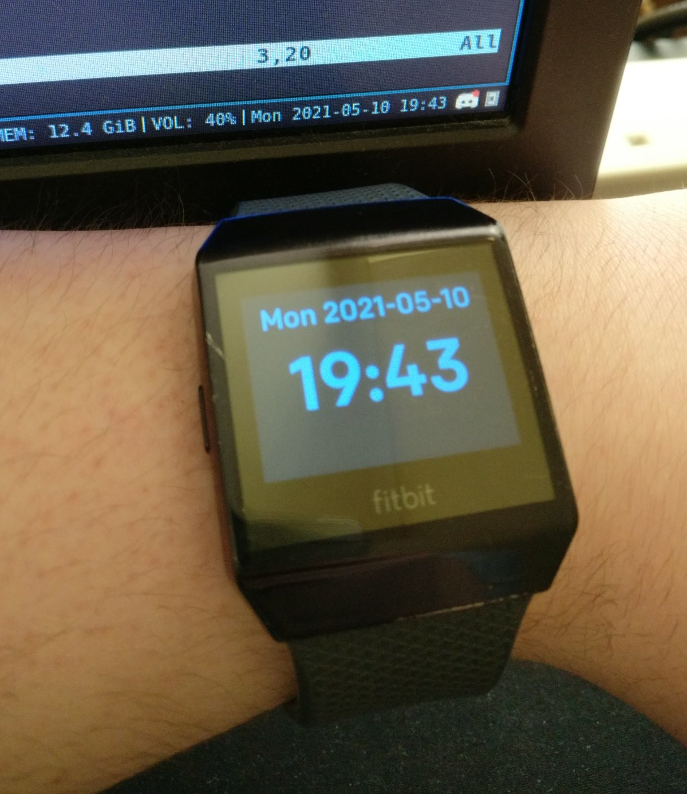

# Terminal (Fitbit Clock)

This is an archive of an old mini project made in 2021, experimenting with the [Fitbit Ionic](https://en.wikipedia.org/wiki/List_of_Fitbit_products#Fitbit_Ionic) smartwatch.

The Terminal Fitbit Clock is an ISO 8601-compliant watch face with a retro,
terminal-like theme. It's designed to look simple and be lightweight in
performance and battery use. Written in JavaScript.
