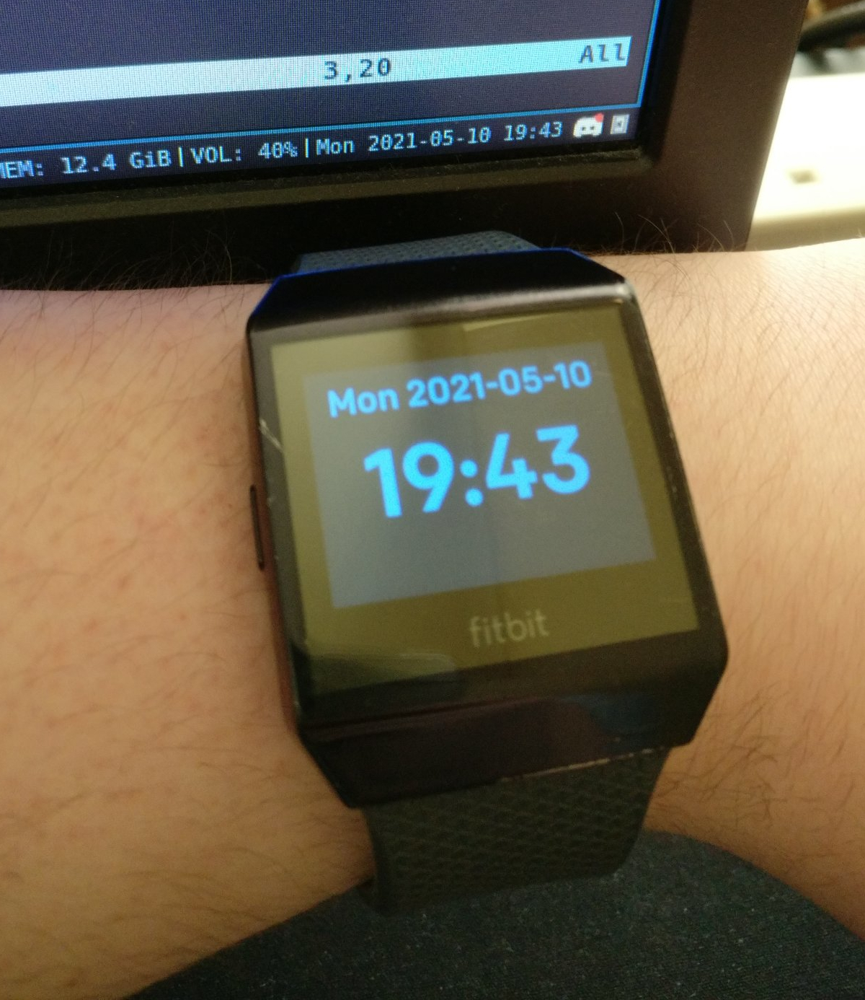

Terminal (Fitbit Clock)
===

The Terminal Fitbit Clock is an ISO 8601-compliant watch face with a retro,
terminal-like theme. It's designed to look simple and be lightweight in
performance.

Compatible Devices
---

Currently the clock supports Fitbit Ionic devices. If you want it supported on
another Fitbit device just let me know!
